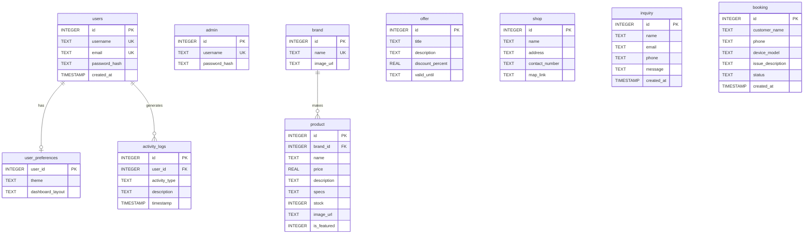
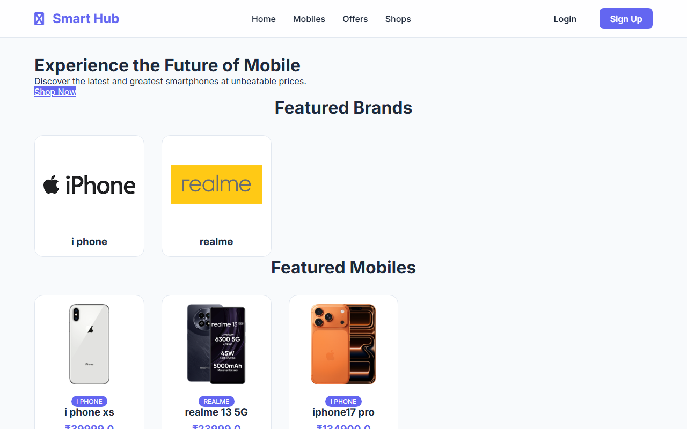
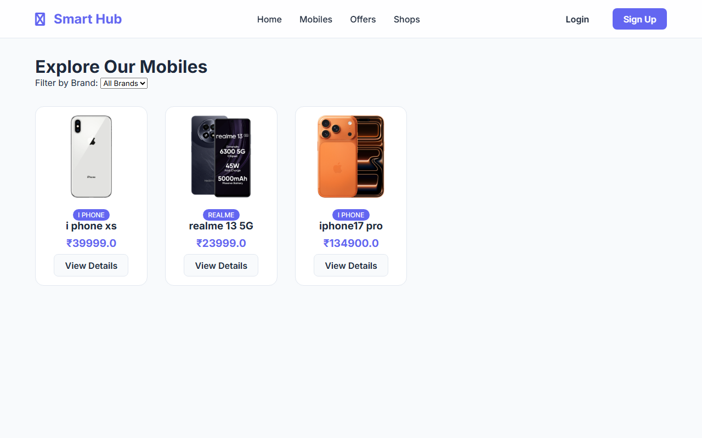
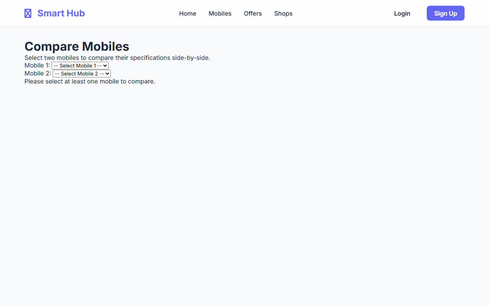
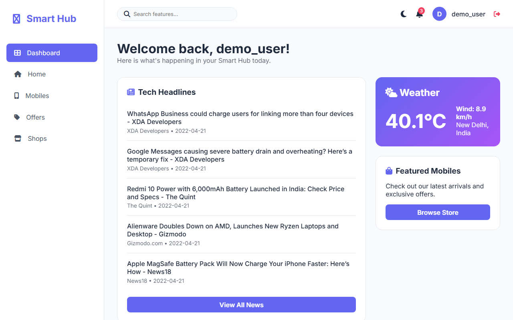
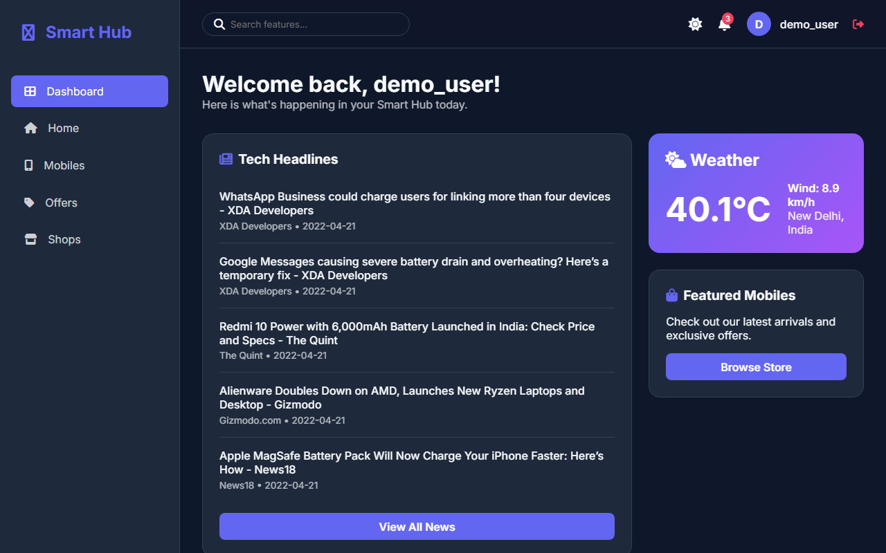
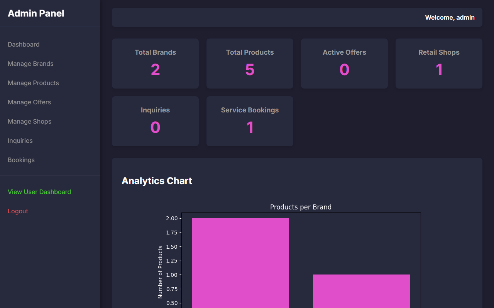
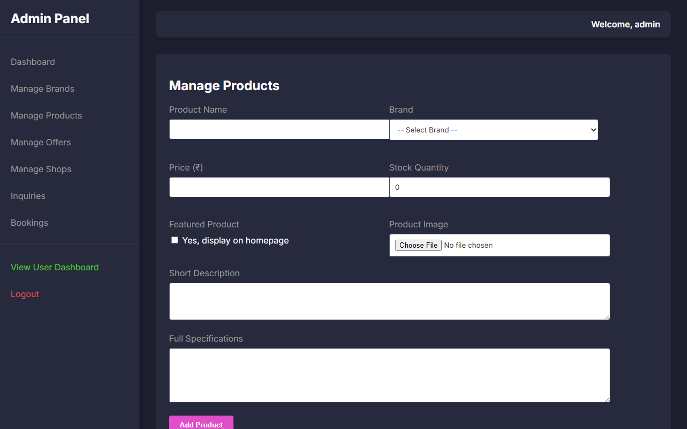

<div align="center">

# 📱 Smart Mobile Hub

**A Full-Stack E-Commerce & Retail Management System**

[](https://python.org)
[](https://flask.palletsprojects.com)
[](https://sqlite.org)
[](#)
[](https://matplotlib.org)
[](#)

</div>

---

##  Overview

**Smart Mobile Hub** is a full-stack web application for a mobile retail business. It combines a public-facing e-commerce catalog with a secure admin dashboard and a personalized user portal — all built with Flask and SQLite.

The project demonstrates real-world patterns: role-based access control, server-side chart generation, live API integrations, session management, and file upload handling.

---

##  What's New in v2

> v1 was released on **May 2, 2026**. v2 was released on **May 4, 2026**.

Version 2 was a major update focused on adding a complete **user identity system** on top of the existing admin + public foundation. Here's everything that changed:

###  New Features Added

| Feature | Details |
|---|---|
| User Registration | `/register` — new accounts with hashed passwords via Werkzeug |
| User Login / Logout | `/login` & `/logout` — session-based auth, independent from admin |
| Personal Dashboard | `/dashboard` — live weather, tech news feed, activity log, stats |
| Dark / Light Theme | `/api/toggle-theme` — preference saved per user in the database |
| Activity Logging | Every login, logout, and action recorded in `activity_logs` table |
| Analytics Page | `/analytics` — activity breakdown by type, restricted to managers |
| User Preferences | Theme and layout settings stored in `user_preferences` table |
| Low Stock Alerts | Shown in user dashboard for manager-role accounts |

###  New Database Tables

| Table | Purpose |
|---|---|
| `users` | Stores registered user accounts (username, email, hashed password) |
| `user_preferences` | Stores per-user theme and layout settings |
| `activity_logs` | Tracks all user actions with timestamps |

###  Code Growth

| File | v1 | v2 | Change |
|---|---|---|---|
| `app.py` | 322 lines | 528 lines | +206 lines |
| `database.py` | 108 lines | 141 lines | +33 lines |
| Routes | 25 routes | 31 routes | +6 routes |
| DB Tables | 7 tables | 10 tables | +3 tables |

---

##  v1 vs v2 — Full Comparison

| Area | v1 (smart_hub) | v2 (smart_hub2) |
|---|---|---|
| **Release Date** | May 2, 2026 | May 4, 2026 |
| **User Accounts** | ❌ None | ✅ Register + Login |
| **User Dashboard** | ❌ None | ✅ Weather, News, Activity |
| **Theme Toggle** | ❌ None | ✅ Dark / Light (saved to DB) |
| **Activity Logging** | ❌ None | ✅ Per-user action tracking |
| **Analytics Page** | ❌ None | ✅ Manager-only charts |
| **User Preferences** | ❌ None | ✅ Stored in DB |
| **Low Stock Alerts** | ✅ Admin only | ✅ Admin + Manager users |
| **Admin Panel** | ✅ Full CRUD | ✅ Full CRUD (unchanged) |
| **Public Site** | ✅ Complete | ✅ Complete (unchanged) |
| **Auth Tables** | `admin` only | `admin` + `users` + `user_preferences` |
| **Total DB Tables** | 7 | 10 |
| **Total Routes** | 25 | 31 |
| **app.py size** | 322 lines | 528 lines |
| **venv included** | ✅ Yes (in zip) | ❌ No (clean zip) |
| **requests lib used** | ❌ No | ✅ Yes (API calls) |

### Routes Added in v2

```
v1 had:                         v2 added:
  /                               /register
  /mobiles                        /login
  /mobiles/<id>                   /logout
  /compare                        /dashboard
  /offers                         /api/toggle-theme
  /shops                          /analytics
  /contact
  /service
  /admin/login
  /admin/logout
  /admin/dashboard
  /admin/chart
  /admin/brands  (+delete)
  /admin/products (+delete)
  /admin/offers (+delete)
  /admin/shops (+delete)
  /admin/inquiries (+delete)
  /admin/bookings (+delete)
```

---

##  System Architecture


---

##  Database Schema



>  Tables added in v2: `users`, `user_preferences`, `activity_logs`
>  Tables carried over from v1: `admin`, `brand`, `product`, `offer`, `shop`, `inquiry`, `booking`

---

##  Application Workflow


---

##  Screenshots

### 🌐 Public Website Interfaces

#### 🏠 Homepage


#### 📱 Product Catalog & Side-by-Side Comparison
| Product Catalog | Product Comparison |
|---|---|
|  |  |

---

###  User Portal

####  Dashboard (Light & Dark Mode Glassmorphism)
| Light Mode | Dark Mode |
|---|---|
|  |  |

---

###  Admin Control Panel

####  Interactive Analytics Dashboard (with live Matplotlib chart)


####  Inventory & Product Management


---

## ✨ Features

### 🌐 Public Website
- Browse the latest smartphones with detailed specs and pricing
- Side-by-side product comparison tool
- Active offers and physical shop branch listings
- Contact form and service/repair booking form

### 👤 User Dashboard *(added in v2)*
- Secure registration and login (passwords hashed with Werkzeug)
- Live **Weather** widget (Open-Meteo API)
- Live **Tech News** feed (NewsAPI)
- Dark/Light theme toggle saved to user preferences
- Personal activity log with visual analytics

###  Admin Panel
- Role-based access control with separate admin session
- Analytics dashboard with live stat counters and Matplotlib charts
- Automated **low stock alerts**
- Full CRUD for products, brands, offers, and shop branches (including image uploads)
- View and manage customer inquiries and service bookings

---

##  Tech Stack

| Layer | Technology |
|---|---|
| Backend | Python 3, Flask, Werkzeug |
| Database | SQLite3 (raw SQL with joins) |
| Frontend | Jinja2 templates, Vanilla CSS3 (glassmorphism) |
| APIs | Open-Meteo (weather), NewsAPI (tech news) |
| Charts | Matplotlib (server-side rendering) |

---

##  Setup

### Prerequisites
- Python 3.8+
- `pip`

### Steps

**1. Navigate into the project folder**
```bash
cd path/to/smart-hub2
```

**2. Create and activate a virtual environment**
```bash
python -m venv venv

# Windows
venv\Scripts\activate

# macOS / Linux
source venv/bin/activate
```

**3. Install dependencies**
```bash
pip install -r requirements.txt
```

**4. Initialize the database**

This creates `smarthub.db`, sets up all tables, and seeds the default admin account.
```bash
python database.py
```

**5. Run the app**
```bash
python app.py
```

**6. Open in your browser**

| Page | URL |
|---|---|
| Public website | http://127.0.0.1:5000/ |
| User login | http://127.0.0.1:5000/login |
| Admin panel | http://127.0.0.1:5000/admin/login |

---

## 🔐 Default Credentials

| Role | Username | Password |
|---|---|---|
| Admin | `admin` | `admin123` |
| User | *(register via `/register`)* | — |

> ⚠️ Change the admin password before deploying to any public environment.

---

## 📂 Project Structure

```
smart-hub2/
├── app.py               # Flask app — all routes and request logic
├── database.py          # Database schema, initialization, and seeding
├── requirements.txt     # Python dependencies
├── smarthub.db          # SQLite database file (auto-generated)
├── static/
│   ├── css/
│   │   ├── style.css    # Public site styles
│   │   └── admin.css    # Admin panel styles
│   └── images/
│       ├── products/    # Product images (uploaded via admin)
│       ├── brands/      # Brand logos
│       └── banners/     # Promotional banners
└── templates/
    ├── base.html        # Public base layout
    ├── admin_base.html  # Admin base layout
    ├── admin/           # Admin interface pages
    │   ├── login.html
    │   ├── dashboard.html
    │   ├── manage_brands.html
    │   ├── manage_products.html
    │   ├── manage_offers.html
    │   ├── manage_shops.html
    │   ├── view_inquiries.html
    │   └── view_bookings.html
    ├── auth/            # Login and registration pages (NEW in v2)
    │   ├── login.html
    │   └── register.html
    ├── dashboard/       # User dashboard pages (NEW in v2)
    │   ├── index.html
    │   └── analytics.html
    ├── errors/          # Custom error pages
    │   ├── 404.html
    │   └── 500.html
    └── public/          # Public-facing pages
        ├── index.html
        ├── mobiles.html
        ├── mobile_details.html
        ├── compare.html
        ├── offers.html
        ├── shops.html
        ├── contact.html
        └── service_booking.html
```

---

##  Key Implementation Notes

- **Authentication:** Admin and user sessions are tracked independently via separate session keys (`admin_logged_in` vs `user_id`). Admin routes are guarded by `before_request()`; user routes use a `login_required` decorator.
- **Isolated auth tables:** The `admin` table and `users` table are completely separate. Admin credentials cannot log in through `/login`, and user credentials cannot log in through `/admin/login`.
- **Database:** All queries use raw SQL via `sqlite3`. No ORM — joins and parameterized queries are written by hand.
- **Charts:** Matplotlib uses the `Agg` (non-GUI) backend to generate PNG charts in memory (`io.BytesIO`) and streams them directly as HTTP responses — no chart files are saved to disk.
- **Image uploads:** Files are sanitized with `secure_filename()` and saved to the appropriate `static/images/` subdirectory. Only the filename is stored in the database.
- **Activity logging:** Every user login, logout, and key action is recorded in `activity_logs`. Admin actions are not currently logged.
- **Secret key:** The `app.secret_key` is hardcoded for development. Use an environment variable (`os.environ.get('SECRET_KEY')`) in production.

---

##  Changelog

### v2.0 — May 4, 2026
- Added full user registration and login system (`/register`, `/login`, `/logout`)
- Added personal user dashboard with live weather and news widgets
- Added dark/light theme toggle with per-user persistence
- Added activity logging for all user actions
- Added `/analytics` page for manager-role users
- Added 3 new database tables: `users`, `user_preferences`, `activity_logs`
- Low stock alerts now visible to manager-role users in addition to admin

### v1.0 — May 2, 2026
- Initial release
- Public product catalog (browse, compare, offers, shops)
- Contact form and service booking form
- Full admin panel with CRUD for products, brands, offers, shops
- Server-side Matplotlib chart in admin dashboard
- Image upload support for products and brands

---

*Built with Python, Flask, and ❤️*
