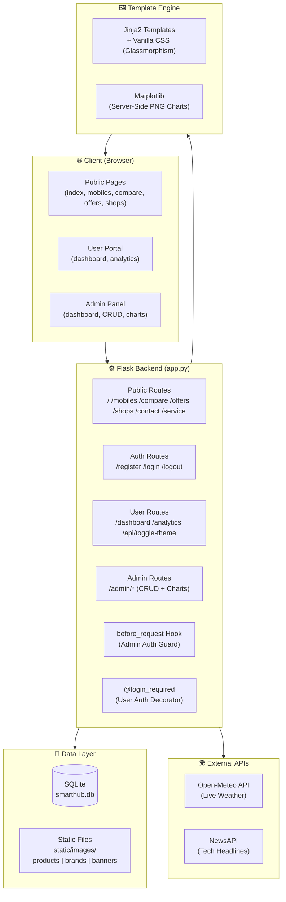
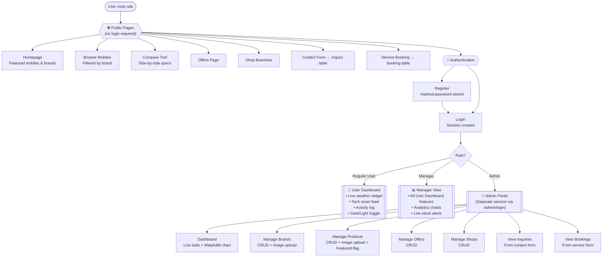

<div align="center">

# 📱 Smart Mobile Hub

**A Full-Stack E-Commerce & Retail Management System**

[](https://python.org)
[](https://flask.palletsprojects.com)
[](https://sqlite.org)
[](#)
[](https://matplotlib.org)

</div>

---

## 📖 Overview

**Smart Mobile Hub** is a full-stack web application for a mobile retail business. It combines a public-facing e-commerce catalog with a secure admin dashboard and a personalized user portal — all built with Flask and SQLite.

The project demonstrates real-world patterns: role-based access control, server-side chart generation, live API integrations, session management, and file upload handling.

---

## 🏗️ System Architecture



---

## 🗄️ Database Schema


---

## 🔄 Application Workflow



---

## 📸 Screenshots

### 🌐 Public Website Interfaces

#### 🏠 Homepage


#### 📱 Product Catalog & Side-by-Side Comparison
| Product Catalog | Product Comparison |
|---|---|
|  |  |

---

### 👤 User Portal

#### 📊 Dashboard (Light & Dark Mode Glassmorphism)
| Light Mode | Dark Mode |
|---|---|
|  |  |

---

### 👑 Admin Control Panel

#### 📈 Interactive Analytics Dashboard (with live Matplotlib chart)


#### ⚙️ Inventory & Product Management


---


## ✨ Features

### 🌐 Public Website
- Browse the latest smartphones with detailed specs and pricing
- Side-by-side product comparison tool
- Active offers and physical shop branch listings
- Contact form and service/repair booking form

### 👤 User Dashboard
- Secure registration and login (passwords hashed with Werkzeug)
- Live **Weather** widget (Open-Meteo API)
- Live **Tech News** feed (NewsAPI)
- Dark/Light theme toggle saved to user preferences
- Personal activity log with visual analytics

### 👑 Admin Panel
- Role-based access control with separate admin session
- Analytics dashboard with live stat counters and Matplotlib charts
- Automated **low stock alerts**
- Full CRUD for products, brands, offers, and shop branches (including image uploads)
- View and manage customer inquiries and service bookings

---

## 🚀 Tech Stack

| Layer | Technology |
|---|---|
| Backend | Python 3, Flask, Werkzeug |
| Database | SQLite3 (raw SQL with joins) |
| Frontend | Jinja2 templates, Vanilla CSS3 (glassmorphism) |
| APIs | Open-Meteo (weather), NewsAPI (tech news) |
| Charts | Matplotlib (server-side rendering) |

---

## 🛠️ Setup

### Prerequisites
- Python 3.8+
- `pip`

### Steps

**1. Navigate into the project folder**
```bash
cd path/to/smart-hub2
```

**2. Create and activate a virtual environment**
```bash
python -m venv venv

# Windows
venv\Scripts\activate

# macOS / Linux
source venv/bin/activate
```

**3. Install dependencies**
```bash
pip install -r requirements.txt
```

**4. Initialize the database**

This creates `smarthub.db`, sets up all tables, and seeds the default admin account.
```bash
python database.py
```

**5. Run the app**
```bash
python app.py
```

**6. Open in your browser**

| Page | URL |
|---|---|
| Public website | http://127.0.0.1:5000/ |
| User login | http://127.0.0.1:5000/login |
| Admin panel | http://127.0.0.1:5000/admin/login |

---

## 🔐 Default Credentials

| Role | Username | Password |
|---|---|---|
| Admin | `admin` | `admin123` |
| User | *(register via `/register`)* | — |

> ⚠️ Change the admin password before deploying to any public environment.

---

## 📂 Project Structure

```
smart-hub2/
├── app.py               # Flask app — all routes and request logic
├── database.py          # Database schema, initialization, and seeding
├── requirements.txt     # Python dependencies
├── smarthub.db          # SQLite database file (auto-generated)
├── static/
│   ├── css/
│   │   ├── style.css    # Public site styles
│   │   └── admin.css    # Admin panel styles
│   └── images/
│       ├── products/    # Product images (uploaded via admin)
│       ├── brands/      # Brand logos
│       └── banners/     # Promotional banners
└── templates/
    ├── base.html        # Public base layout
    ├── admin_base.html  # Admin base layout
    ├── admin/           # Admin interface pages
    ├── auth/            # Login and registration pages
    ├── dashboard/       # User dashboard pages
    ├── errors/          # Custom 404 and 500 pages
    └── public/          # Public-facing pages
```

---

## 🔑 Key Implementation Notes

- **Authentication:** Admin and user sessions are tracked independently. Admin routes are protected via a `before_request` hook; user routes use a `login_required` decorator.
- **Database:** All queries use raw SQL via `sqlite3`. No ORM — joins and parameterized queries are written by hand.
- **Charts:** Matplotlib generates PNG charts server-side, which are served inline to the admin dashboard.
- **Image uploads:** Product and brand images are saved to `static/images/` subdirectories and referenced by filename in the database.
- **Secret key:** The `app.secret_key` is hardcoded for development. Use an environment variable in production.

---

*Built with Python, Flask, and ❤️*
