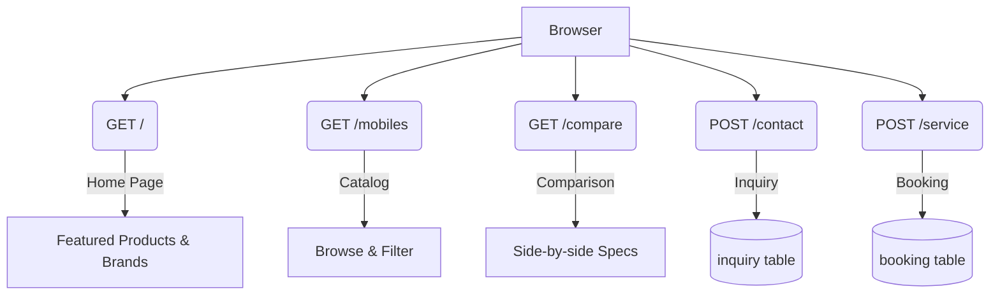
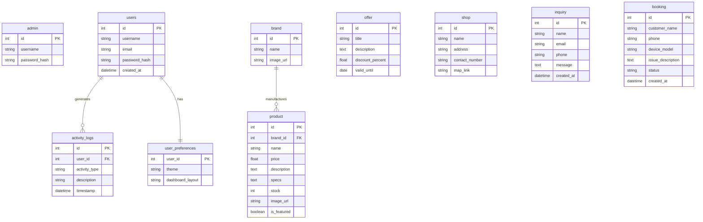

<div align="center">

# 📱 Smart Mobile Hub

**A Full-Stack E-Commerce & Retail Management System**

[](https://python.org)
[](https://flask.palletsprojects.com)
[](https://sqlite.org)
[](#)
[](#)

*A comprehensive solution for mobile retail businesses, featuring a public e-commerce catalog, secure user portals, and a powerful admin dashboard.*

</div>

---

## 📖 Table of Contents

- [Overview](#-overview)
- [Features](#-features)
- [Tech Stack](#-tech-stack)
- [Getting Started](#-getting-started)
- [Application Workflow](#-application-workflow)
- [Database Architecture](#-database-architecture)
- [Project Structure](#-project-structure)
- [Implementation Details](#-implementation-details)

---

## 📖 Overview

**Smart Mobile Hub** is a robust, full-stack web application tailored for the mobile retail industry. It seamlessly integrates a public-facing e-commerce storefront with a secure, feature-rich admin dashboard and a personalized user portal. 

Built on a foundation of **Python, Flask, and SQLite**, this project demonstrates industry-standard patterns including:
- **Role-Based Access Control (RBAC)**
- **Server-Side Data Visualization**
- **Third-Party API Integrations**
- **Secure Session Management**
- **File Upload & Asset Handling**

---

## ✨ Features

### 🌐 Public E-Commerce Storefront
- **Dynamic Catalog:** Browse the latest smartphones with comprehensive specifications and pricing.
- **Comparison Tool:** Evaluate products side-by-side to make informed purchasing decisions.
- **Promotions & Locations:** View active discount offers and physical shop branch locations.
- **Customer Engagement:** Integrated contact forms and service/repair booking system.

### 👤 Personalized User Dashboard
- **Secure Authentication:** Registration and login system with Werkzeug password hashing.
- **Live Widgets:** Real-time **Weather** (Open-Meteo API) and **Tech News** (NewsAPI) integrations.
- **Customization:** Persistent Dark/Light theme preferences.
- **Activity Tracking:** Personal activity log with visual analytics.

### 👑 Administrative Control Panel
- **Secure Access:** Isolated admin sessions for maximum security.
- **Analytics Dashboard:** Real-time statistical counters and server-rendered Matplotlib charts.
- **Inventory Management:** Automated **low stock alerts** to maintain product availability.
- **Content Management:** Full CRUD operations for products, brands, offers, and shop branches (includes secure image uploading).
- **Customer Service:** Centralized hub for managing customer inquiries and service bookings.

---

## 🚀 Tech Stack

| Layer | Technology | Description |
|:---|:---|:---|
| **Backend** | Python 3, Flask | Core application logic and routing |
| **Security** | Werkzeug | Password hashing and session security |
| **Database** | SQLite3 | Relational database utilizing raw SQL & joins |
| **Frontend** | Jinja2, HTML5, CSS3 | Server-rendered templates with modern Glassmorphism UI |
| **Integrations** | Open-Meteo, NewsAPI | Live weather data and technology news feeds |
| **Analytics** | Matplotlib | Server-side rendering of analytical charts |

---

## 🛠️ Getting Started

### Prerequisites

Ensure you have the following installed on your local machine:
- **Python 3.8** or higher
- **pip** (Python package installer)

### Installation & Setup

**1. Clone the repository and navigate to the project directory**
```bash
git clone https://github.com/yourusername/smart-hub2.git
cd smart-hub2
```

**2. Set up a virtual environment**
```bash
python -m venv venv

# On Windows:
venv\Scripts\activate

# On macOS / Linux:
source venv/bin/activate
```

**3. Install dependencies**
```bash
pip install -r requirements.txt
```

**4. Initialize the database**

This script will create `smarthub.db`, build all required tables, and seed the default administrator account.
```bash
python database.py
```

**5. Launch the application**
```bash
python app.py
```

**6. Access the application**

Open your web browser and navigate to the following URLs:

| Portal | URL |
|:---|:---|
| **Public Storefront** | [http://127.0.0.1:5000/](http://127.0.0.1:5000/) |
| **User Portal** | [http://127.0.0.1:5000/login](http://127.0.0.1:5000/login) |
| **Admin Dashboard** | [http://127.0.0.1:5000/admin/login](http://127.0.0.1:5000/admin/login) |

---

## 🔐 Default Credentials

For initial testing and setup, use the following default accounts:

| Role | Username | Password | Notes |
|:---|:---|:---|:---|
| **Administrator** | `admin` | `admin123` | ⚠️ **Must be changed before production deployment.** |
| **Standard User** | *(Register via `/register`)* | — | Create a new account to test user features. |

---

## 🗺️ Application Workflow

The platform handles three distinct user journeys, ensuring clean separation of concerns and security.

### 1. Public Visitor Journey


### 2. Registered User Journey
- **Authentication:** Users register/login with hashed credentials. Sessions are managed via `session['user_id']`.
- **Dashboard:** Features third-party API integrations (Weather/News) and activity tracking.
- **Analytics:** Managers can access aggregated activity charts.

### 3. Administrator Journey
- **Authentication:** Admin credentials exist in an isolated `admin` table. Sessions use `session['admin_logged_in']`.
- **Security:** All `/admin/*` routes are protected by a `before_request` hook.
- **Management:** Full CRUD access to inventory, with Matplotlib generating real-time analytics reports in memory.

---

## 🗄️ Database Architecture

The application utilizes a relational SQLite database schema.



---

## 📂 Project Structure

```text
smart-hub2/
├── app.py               # Core application and routing logic
├── database.py          # Database initialization and seeding script
├── requirements.txt     # Python dependencies list
├── smarthub.db          # SQLite database (auto-generated)
├── static/              # Static assets
│   ├── css/             # Stylesheets (style.css, admin.css)
│   └── images/          # Uploaded product images, brand logos, banners
└── templates/           # Jinja2 HTML templates
    ├── admin/           # Admin dashboard and management interfaces
    ├── auth/            # Registration and login forms
    ├── dashboard/       # User portal and analytics
    ├── errors/          # Custom 404/500 error pages
    └── public/          # Public-facing storefront pages
```

---

## 🔑 Implementation Details

- **Isolated Authentication:** The `admin` and `users` tables are strictly separated. Admin and user sessions are distinct (`admin_logged_in` vs `user_id`), preventing cross-role access.
- **Raw SQL Operations:** Database interactions utilize raw SQL queries with parameterized inputs to prevent SQL injection. No ORM is used, providing complete control over database joins and performance.
- **In-Memory Chart Generation:** Statistical charts are rendered on the server using Matplotlib's `Agg` backend. Images are streamed directly to the client via `io.BytesIO`, ensuring no temporary files clutter the server.
- **Secure File Handling:** User-uploaded images are sanitized using Werkzeug's `secure_filename()` before being saved to the static directory.
- **Security Best Practices:** Environment variables should be used for `app.secret_key` in production environments.

---

<div align="center">
  <i>Designed and built with ❤️ using Python and Flask.</i>
</div>
